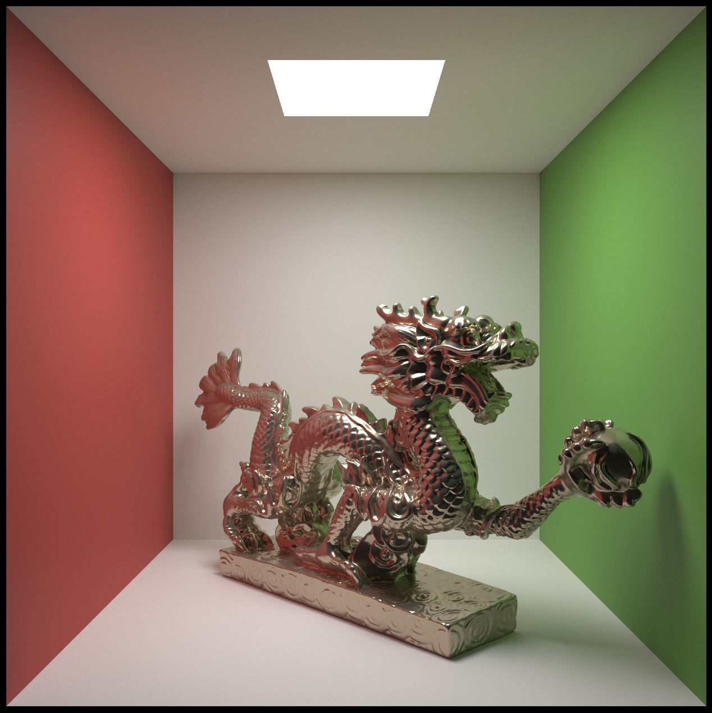
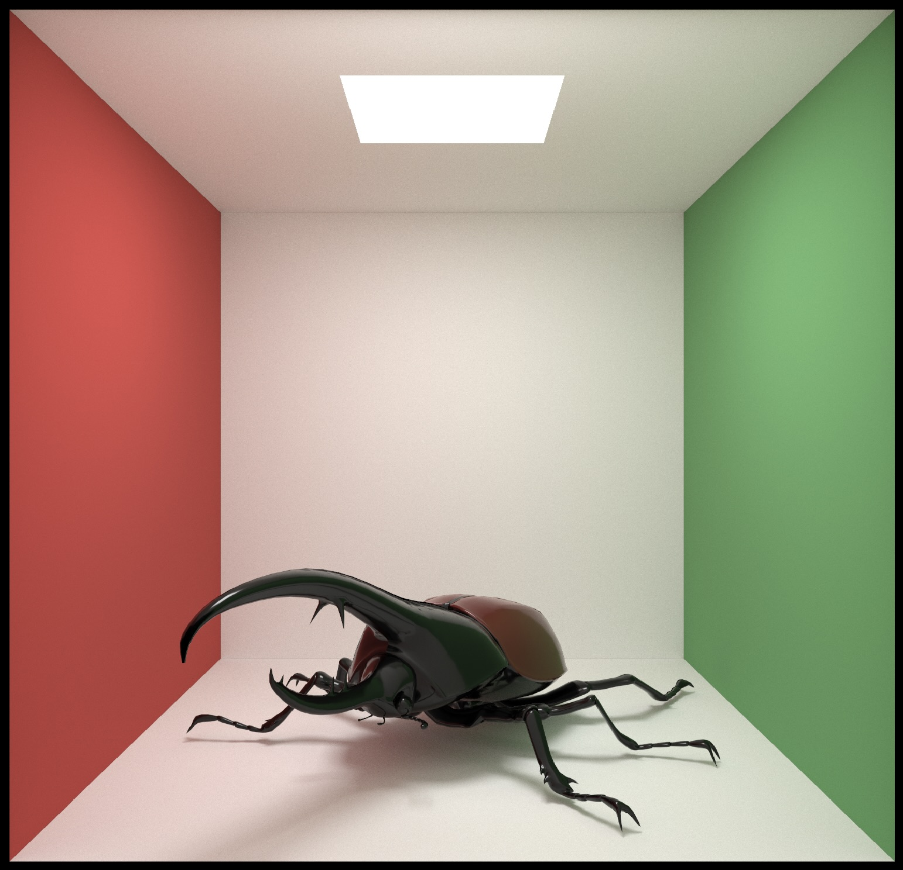

# RayTracer
This project is a upgrade for my honor project [raytracing](https://github.com/Joecheong2006/raytracing)

## Upgrade
* Support OpenGL Version >= 3.3 using TBO since the original only support OpenGL Version >= 4.3
* Switch to CMake with support for windows, Mac, and Linux
* Added static BVH to speed up rendering

### Clone
```
git clone --recursive https://github.com/Joecheong2006/RayTracer.git
```

### Build & Run
```
mkdir build && cd build && cmake .. && make && ./raytracer
```

## Dragon2


## Hercules beetle

